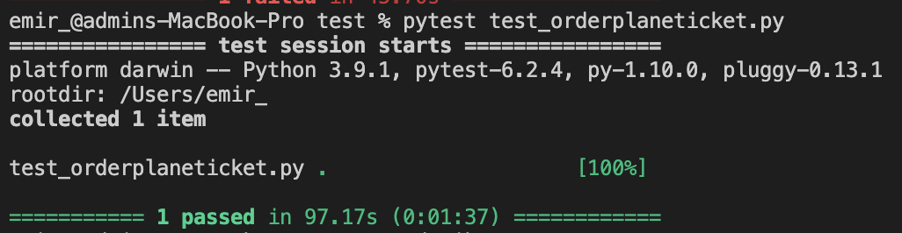

# Automation for Ordering Flight Ticket - Tiket.com
A Web automation script to create transaction for a flight product from search until choose payment method for a non-login user

>**NOTE**: This script was completed on 15 July 2021. This script may no longer work and throw error in the future as changes made to the website.

## Table of content
- [Automation for Ordering Flight Ticket - Tiket.com](#automation-for-ordering-flight-ticket---tiketcom)
  - [Table of content](#table-of-content)
  - [Assumption](#assumption)
  - [Spesification](#spesification)
  - [How to run script](#how-to-run-script)
  - [Screenshot](#screenshot)

## Assumption

```
Name: John Doe  
Country: Indonesia  
Email: johndoe@mail.com  
Phone Number: 628123456789
```

```
Origin: Jakarta  
Destination: Surabaya
```

```
Cabin Class: Business
Passenger: 1 
Type: Rountrip
```

```
Start Date: 22 July 2021  
End Date: 29 July 2021
```

```
Departure Airplane: any available airplane (recommended)  
Return Airplane: any available a airplane (recommended)
```

```
Departure time from Jakarta: any time  
Departure time from Surabaya: any time
```

```
Payment method: BNI Virtual Account
```

## Spesification

- **Selenium** v3.141.0  
- **Pytest** 6.2.4
- **Python** v3.9.1  
- **ChromeDriver** 91.0.4472.101  

Tested on macOS 11.4 (Big sur) with above spec. 

## How to run script
1. Make sure python is installed on your machine
2. Install pytest. [Read more](https://docs.pytest.org/en/6.2.x/getting-started.html)
   ````
   pip install -U pytest
   ````
3. Intall selenium for python including chrome drivers & selenium server. [Follow this instructions](https://selenium-python.readthedocs.io/installation.html)
4. Clone this repo to your local machine

   ```
    git clone https://github.com/ahmadf20/tiket.com-assessment
   ```

5. Go to the dicrectory
   ```
    cd tiket.com-assessment
   ```
6. Run the script
   ```
   pytest test_orderplaneticket.py
   ```
7. Automation script will open new chrome window


## Screenshot



